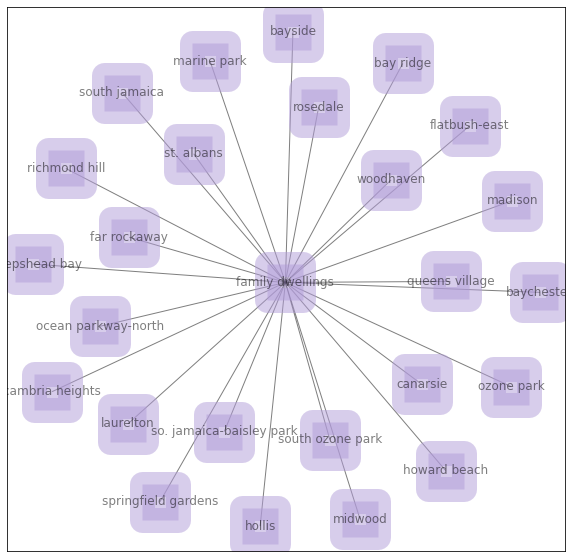

```{r setup, include=FALSE}
library(flexdashboard)
```

Basic EDA
=== 

Column {data-width=350}
-----------------------------------------------------------------------

### Scatter plot of land value vs year built

```{r}
housing <- read.csv('.././anly503-fall2020-project-nuot/housing.csv')
library("ggplot2")
library(maps)
library(ggmap)

library(dplyr)
library(tidyverse)

chousing <- housing %>% drop_na(landvalue, totalarea, unitcnt,yearbuilt,airconditioningtypeid)
colnames(chousing)[4]<-"FIPS"
fips <- read.csv('.././anly503-fall2020-project-nuot/FIPS.csv')


chousing$FIPS <-as.integer(chousing$FIPS)

chousing <- inner_join(fips, chousing, by = "FIPS")
chousing$lat <- chousing$lat /1000000
chousing$long <- chousing$long /1000000

year <- chousing[housing['yearbuilt'] > 1900,]
data <- year[year['unitcnt'] < 5,]
data <-data %>% drop_na()

plt <- qplot(yearbuilt, landvalue, data=data, main="Land Value Info",xlab="Year Built", ylab="Land Value", color = unitcnt) + scale_y_continuous(labels = scales::dollar_format()) + scale_colour_continuous(name = "Unit Count", low = "white", high = "Purple")
plt
```

### Scatter plot of tax value vs year built
```{r}
plt <- qplot(yearbuilt, structurevalue, data=data, main="Structure Value Info",xlab="Year Built", ylab="Structure Tax Value", color = unitcnt) + scale_y_continuous(labels = scales::dollar_format()) + scale_colour_continuous(name = "Unit Count", low = "white", high = "Purple")
plt
```

Column {data-width=350}
-----------------------------------------------------------------------

### Most of the housing that current in market are built after 1960

```{r}

p1<- ggplot(year, aes(x=yearbuilt)) +  
  geom_histogram(aes(y=..density..), position="identity", alpha=0.5, color="#9966CC", fill="#9966CC",bins=40) + 
  geom_vline(aes(xintercept=mean(yearbuilt)),
            color="blue", linetype="dashed", size=1) +
  geom_density(alpha=0.6, color ='grey') + 
  scale_x_continuous(name="Year Built", labels = scales::comma)+
  ggtitle("Distribution of construction of housing")

p1
```

### Majority of housing in the market has fewer bedrooms

```{r}

cnt <- chousing[housing['bedroomcnt'] > 0,]

p<-ggplot(cnt, aes(x=bedroomcnt)) + 
  geom_histogram(aes(y=..density..), position="identity", alpha=0.5, color="#9966CC", fill="#9966CC",bins=40) + 
  geom_vline(aes(xintercept=mean(bedroomcnt)),
            color="blue", linetype="dashed", size=1) +
  geom_density(alpha=0.6, color ='#B8BC86') + 
  scale_x_continuous(name="Bedroom count", labels = scales::comma)+
  ggtitle("Distribution of Number of Bedroom")

p
```


Geo Analysis
===
Column {data-width=350}
-----------------------------------------------------------------------

### To better understand the distribution of housing in Los Angeles county
```{r}
library(ggplot2)
library(sf)
shpfile <- ".././anly503-fall2020-project-nuot/tl_2019_us_county-1/tl_2019_us_county.shp"
sh <- sf::st_read(shpfile)
library(broom)
library(dplyr)
spdf_fortified <- fortify(sh, region = "NAME")
spdf_fortified$FIPS <- as.numeric(paste0(spdf_fortified$STATEFP,spdf_fortified$COUNTYFP))
data <- left_join(x = chousing, y = spdf_fortified, by = "FIPS")
data1 <- group_by(data,yearbuilt)
data1 <- data1[!duplicated(data1$yearbuilt), ]
locations <- as_tibble(data1)
library(sf)
#install.packages("mapview")
library(mapview)
locations_sf <- st_as_sf(locations, coords = c("long", "lat"), crs = 4326)
mapview(locations_sf, color = "#B8BC86", cex= 'structurevalue',layer.name = "housing distribution")
```

Time Series and Network Analysis
===
Column {data-width=350}
-----------------------------------------------------------------------

### Plot below shows how the land value and total tax value vary as the year approaching to present
```{python,eval=FALSE}
import pandas as pd
import matplotlib.pyplot as plt
from pandas import Series
from pandas import DataFrame


housing = pd.read_csv('.././anly503-fall2020-project-nuot/properties_2017.csv', low_memory = False)

housing = housing[['latitude','longitude','fips','yearbuilt','finishedsquarefeet15','airconditioningtypeid','landtaxvaluedollarcnt','structuretaxvaluedollarcnt','taxvaluedollarcnt','unitcnt','bathroomcnt','bedroomcnt']]
housing = housing.rename(columns={"finishedsquarefeet15": "totalarea", "taxvaluedollarcnt": "totaltaxamount","landtaxvaluedollarcnt":"landvalue","structuretaxvaluedollarcnt":"structurevalue"},inplace = True)
#housing = housing.dropna(subset=['airconditioningtypeid','totaltaxamount'], how='all',inplace = True)
#housing = housing.dropna(subset=['yearbuilt'], how='all', inplace=True)
housing.to_csv('housing.csv')
import pandas as pd
import matplotlib.pyplot as plt
from pandas import Series
from pandas import DataFrame

housing = pd.read_csv('.././anly503-fall2020-project-nuot/housing.csv')
  
ts = DataFrame(housing.sort_values(by=['yearbuilt']))
ts = ts[ts['yearbuilt']>1900]

from pandas import Series
ts1= Series(ts.totaltaxamount, index=ts.yearbuilt)
ts2= Series(ts.landvalue, index=ts.yearbuilt)

ts1= Series(ts.totaltaxamount, index=ts.yearbuilt)
ts2= Series(ts.landvalue, index=ts.yearbuilt)

ts1 = ts1.cumsum()
ts2 = ts2.cumsum()


plt.rc('font', size=14)
fig, ax = plt.subplots(figsize=(10, 6))

# Specify how our lines should look
ax.plot(ts1, color='tab:purple', label='total value')
ax.plot(ts2, color='tab:olive', linestyle='--',
        label='Land value')
# Same as above
ax.set_xlabel('Year Build')
ax.set_ylabel('Total Tax Amount')
ax.set_title('Time series for tax amount in year 1900 - 2016')
ax.grid(True)
ax.legend(loc='upper left')
fig.savefig('Figure1.png')
```

```{r, echo=FALSE, fig.width=5, fig.height=5}

```

### I also curious which counties are more interested in building the house by their own.

```{python, eval = FALSE}
import pandas as pd
import networkx as nx
import matplotlib.pyplot as plt


import networkx as nx
import matplotlib.pyplot as plt

data = pd.read_csv('ny.csv')
data = data[data['BuildingCategory'] =='01 ONE FAMILY DWELLINGS']

data = data.nlargest(20, 'Count')

g = nx.from_pandas_edgelist(data, source='Neighborhood', target='BuildingCategory', edge_attr= 'Count')
pos = nx.spring_layout(g)


labels = set(data['Neighborhood'].tolist())

plt.figure(1,figsize=(10,10)) 
nx.draw_networkx(g, pos,with_labels=labels, node_size=1300, node_color="#B19CD9", node_shape="s", alpha=0.5, linewidths=20)
plt.save('plt2.png')
```

```{r, echo=FALSE, fig.width=5, fig.height=5}

```
